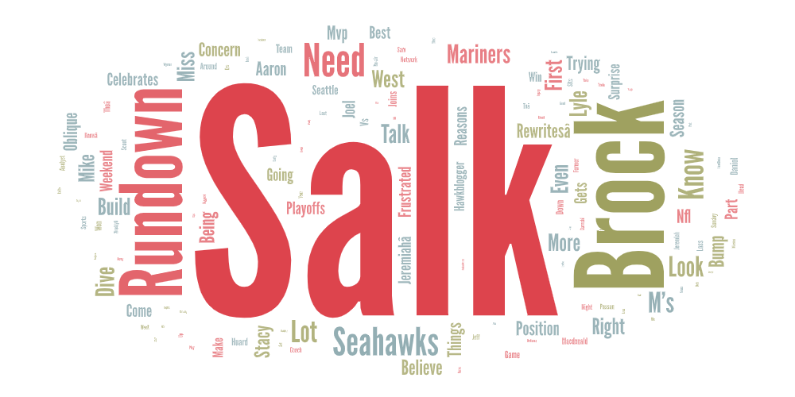
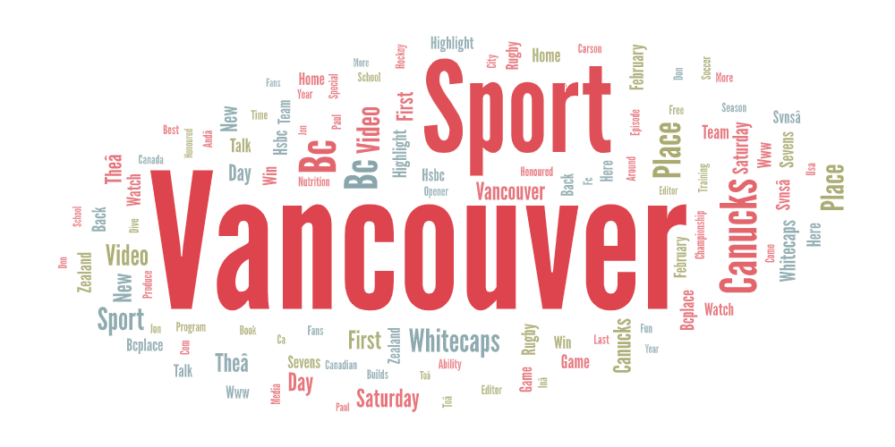
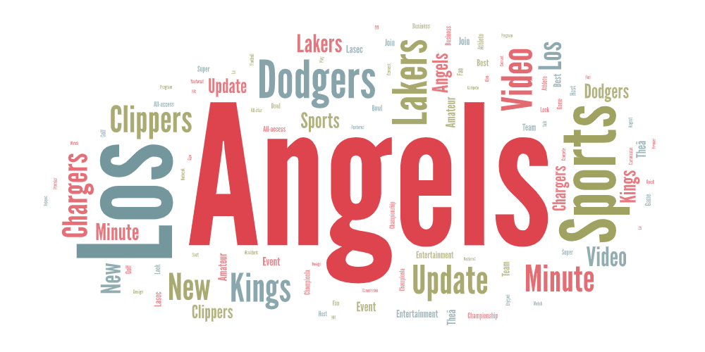

# Sports Popularity Across Cities: YouTube Data Analysis

## Topic and Search Parameters
For this lab, I explored the topic of **sports popularity in different cities** using YouTube video data. I chose to look at **Seattle, Vancouver, and Los Angeles** as they are all major urban areas on the West Coast but differ in population size, media markets, and sports culture.

To collect the data, I chose three search terms:

- `"Seattle Sports"`  
- `"Vancouver Sports"`  
- `"Los Angeles Sports"`  

The goal was to compare which sports and teams are most discussed in each city. These searches were selected to focus on local sports coverage and to capture trends in what sports content people are consuming online. From the collected data, I generated word clouds to visualize which terms and topics appeared most frequently.

---

## Purpose of the Comparison
I wanted to see how sports culture differs across cities by examining YouTube sports content related to Seattle, Vancouver, and Los Angeles. Each of these cities has a mix of professional and amateur sports teams, as well as strong local media coverage. By comparing them, I wanted to understand which teams and sports were the most popular searched (on Youtube) in different locations.

---

## Word Cloud Comparison

### Seattle
The Seattle word cloud was dominated by the names "Brock" and "Salk", which come from the popular Brock and Salk sports podcast that covers sports news in Seattle. This indicates that podcast-based commentary plays a major role in Seattle sports content on YouTube. I initially expected team names such as the Seahawks, Mariners or Sounders, along with game highlights or press conferences, to be more prominent. Instead, these appeared less frequently than expected. Other common terms focused on in-game actions or commentary, such as "dive" and "rundown", suggesting detailed analysis or commentary rather than straightforward highlights.

### Vancouver
In Vancouver’s word cloud, the most common terms were "Vancouver" and "sport", which closely reflected the search keywords. I was pleased to see local teams like the Canucks (hockey) and Whitecaps (soccer) appear at noticeable sizes, showing they were well represented in the dataset. However, hockey was less prevalent than expected, especially given Vancouver’s/Canada's strong association with the sport. Terms such as "BC" and "Place" were also pretty large and common, referring to BC Place, one of the city’s main sports stadiums. Interestingly, "soccer" appeared prominently, which was somewhat unexpected and suggests strong or recent soccer-related coverage.

### Los Angeles
The Los Angeles word cloud most closely matched my expectations. It prominently featured major local sports teams, including the Angels and Dodgers (largest/most common), followed by the Clippers, Chargers, Lakers, and Kings (somewhat smaller, but very common). Unlike Seattle and Vancouver, team names clearly dominated the results, indicating a strong focus on professional sports franchises rather than general commentary or unrelated terms. Overall, Los Angeles produced the cleanest and most relevant word cloud, with a wide variety of teams accurately represented.

### Summary
Overall, the best results came from Los Angeles, where the word cloud clearly reflected the city’s diverse professional sports landscape. Vancouver produced intermediate results, showing some local teams alongside broader or more general terms. Seattle produced the least relevant results, as a single popular podcast dominated the dataset rather than individual teams or sporting events.

---

## Possible Reasons for Observed Patterns
There could be a few possible reasons that explain the patterns observed in the word clouds. In Seattle, the dominance of the Brock and Salk podcast may be influenced by YouTube’s search algorithm prioritizing popular channels over specific team-related content. Vancouver’s results may reflect broader use of the term "sports", allowing soccer-related content to surface more frequently, possibly due to recent events or metadata tagging. In Los Angeles, the large number of professional teams across multiple leagues likely contributes to higher visibility and repetition of team names in sports-related videos.

---

## Unexpected Findings
One of the most surprising outcomes was the dominance of a single podcast in Seattle, which heavily skewed the word cloud away from teams and games. Vancouver’s emphasis on soccer over hockey also stood out, given the city’s strong hockey culture. In contrast, Los Angeles aligned closely with my expectations, with multiple teams clearly and accurately represented.

---

## Improvements for Future Research
This research could be improved in several ways, such as choosing more specific search terms, such as "Seattle Seahawks highlights" or "Vancouver Canucks recap", could reduce irrelevant results. Increasing the number of videos collected per search would improve the reliability of the data as well. Filtering out podcast channels or repeated channels could help focus the analysis on team-based coverage. Additionally, separating content types like highlights, fan reactions, and news, as well as applying date or season filters could provide deeper insight into trends over time.

---

## Assets

### Seattle Word Cloud
  

### Vancouver Word Cloud
  

### Los Angeles Word Cloud
  

### CSV Files
You can download the collected data here:  
- [Seattle Sports CSV](assets/seattle_sports.csv)  
- [Vancouver Sports CSV](assets/vancouver_sports.csv)  
- [Los Angeles Sports CSV](assets/LA_sports.csv)

---

*This analysis was completed using data collected via a YouTube crawler built in Python and executed in Google Colab. Word Clouds were produced through wordart.com.*
